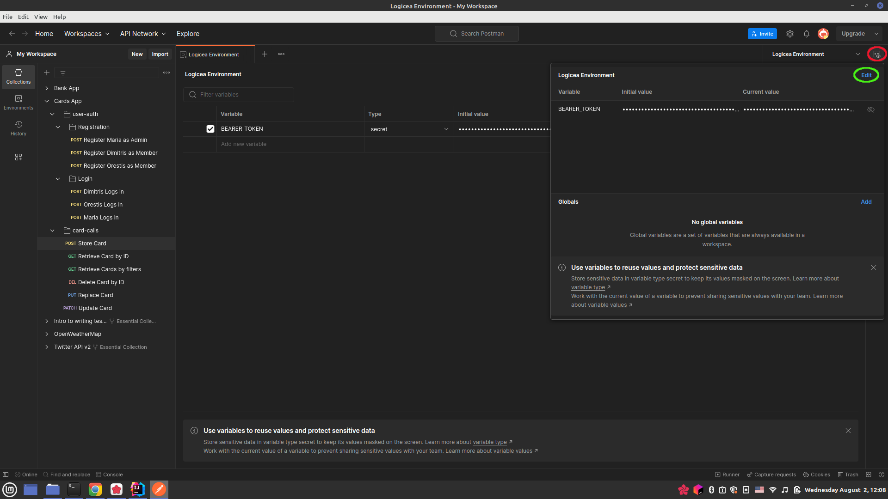
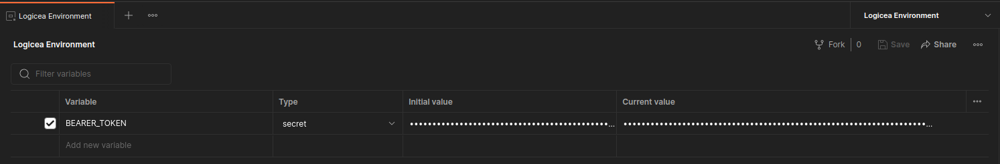
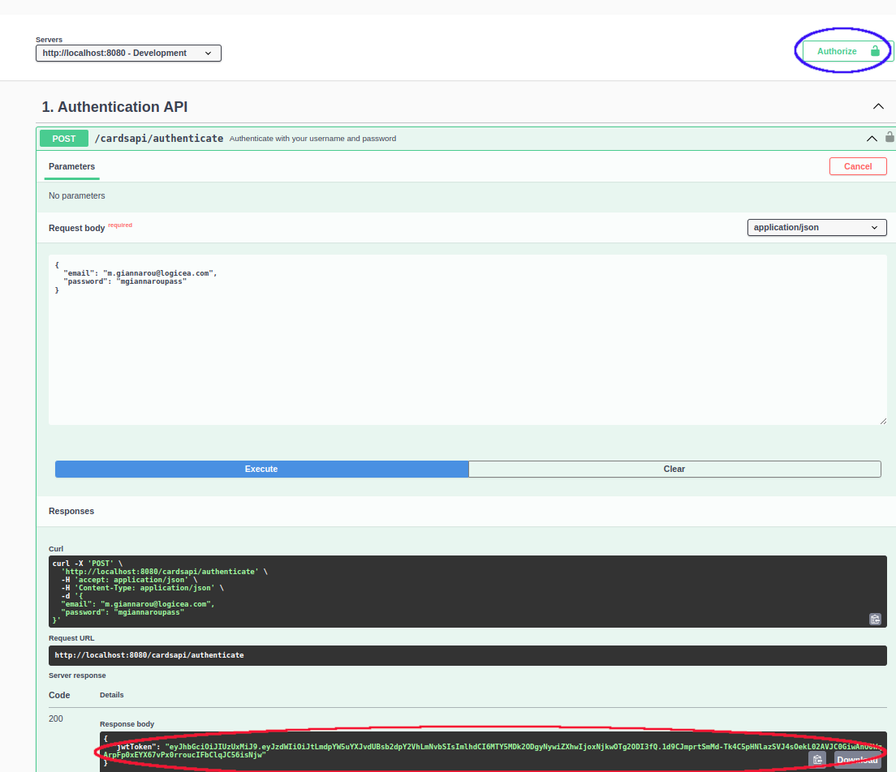
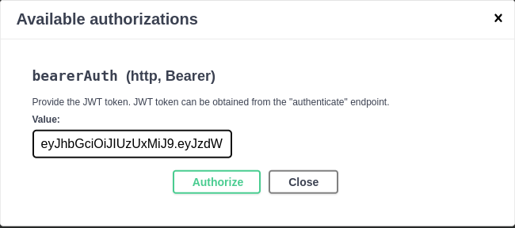
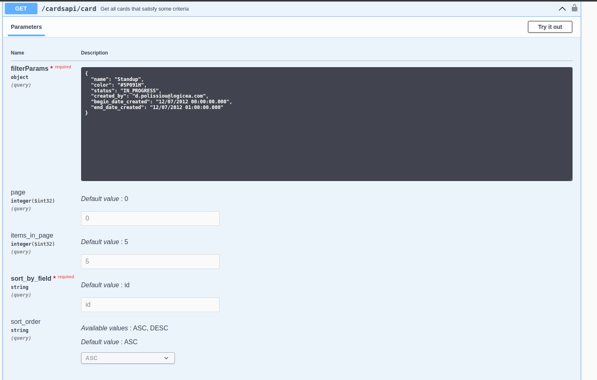
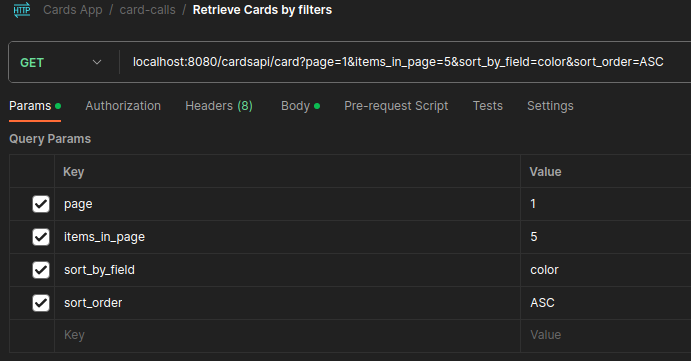
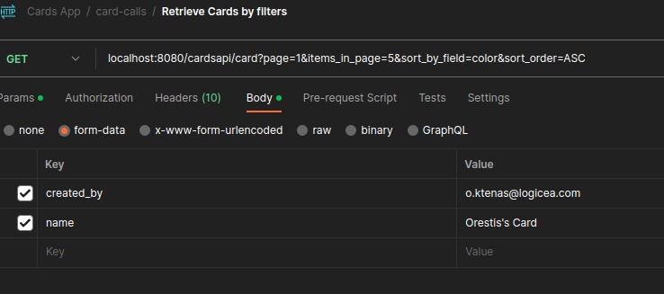
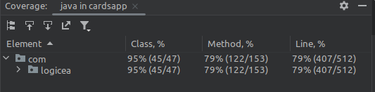

# README

## Getting started

### Database 

The code has been developed and tested on a Linux Mint 20.2 Uma machine with kernel version `5.15.0-78-generic` and Java 17.
We employ a MySQL database for persistence, and an H2 database for tests. The `application.properties` file of the 
application lets it create all the entities on the database, so minimal database legwork should be required.
You just need to create the database `cards_app_db`, a user named `cardsappuser` with the provided password
and grant all privileges on `cards_app_db` to `cardsappuser`. This is how we did it in our machine. Open up a shell and type:

```shell
sudo mysql --password 
```
Input your `sudo` password, and this should open up the `mysql` prompt, where you should type:
```mysql
create database cards_app_db; -- Creates the new database
create user 'cardsappuser'@'%' identified by 'ThePassword882100##'; -- Same password we have in the application.properties
grant all on cards_app_db.* to 'cardsappuser'@'%'; -- Gives all privileges to the new user on the newly created database
```

You can now run the Spring Server by running the `CardsApplication` class. Once the server
is up - and - running, for security reasons, we recommend downgrading the privileges of `'cardsappuser'` to just the absolutely 
necessary ones through the `mysql` prompt:

```mysql
revoke all on cards_app_db.* from 'cardsappuser'@'%';
grant select, insert, delete, update on cards_app_db.* to 'cardsappuser'@'%';
```

### Interacting with the API

You can use plain `curl` calls, a tool like POSTMAN or even OpenAPI 3. 
Some details for Postman and OpenAPI follow.

#### Postman 

We provide a POSTMAN collection in the file `Cards App.postman_collection.json`. This file
has example calls that you can use to interact with the API. Every call to the
cards API has the `Authorization` header assigned to the string `Bearer {{BEARER_TOKEN}}`, where
`{{BEARER_TOKEN}}` is a POSTMAN environment variable that contains the JWT Token
returned by the authentication endpoint (see below, section Registration & Authentication). Here is how
you can set this variable. First, click on the "Environment Quick Look" icon on the
upper-right corner, then on "Edit":



This will pull up the "Environments" tab, and you can set a variable called
`BEARER_TOKEN` with the current value of the JWT token as the current value.




#### OpenAPI 

We have prepared  an `OpenApi` bean in class `OpenAPI30Configuration` and have several annotations in our 
controllers and DTOs that make the OpenApi 3 page rendered in a user-friendly
fashion. Once the app is running, access the page by sending your browser to
http://localhost:8080/swagger-ui/index.html#.

To authenticate using the OpenAPI page, make the same `POST` call described above
to the `cardsapi/authenticate` endpoint (make sure the user has been registered first!), copy the JWT token returned and then click on the "Authorize" button:



Paste the JWT token and click on "Authorize":



This should now "unlock" all the card REST calls so that you can perform them without
getting a 401 "Unauthorized" Http Status code.

An advantage of using the OpenAPI page over the Postman collection is better documentation of the endpoints,
with examples of the status codes that are returned as well as various example formats of the
payloads. A disadvantage is that you will have to
re-authenticate if you refresh the page. 

### User Registration & Authentication

The API generates JWT tokens for authentication, with the secret stored in `application.properties`. The provided POSTMAN collection
shows some examples of user registration, but you can also use the OpenAPI page 
if you prefer. For example, `POST`-ing the following payload
to the `cardsapi/register` endpoint registers Maria Giannarou as an admin:

```json
{
  "email" : "m.giannarou@logicea.com",
  "password" : "mgiannaroupass",
  "role" : "ADMIN"
}
```

while the following registers Orestis Ktenas as a member:

```json
{
    "email" : "o.ktenas@logicea.com",
    "password" : "oktenaspass",
    "role" : "MEMBER"
}
```
Attempting to register a user twice will result in a `409 CONFLICT` Http Error Code
sent back.

After registering, you should receive a JSON with just your username (password ommitted for security) and a `201 CREATED` Http Response code:

```json
{
  "username": <THE_USERNAME_YOU_CHOSE>
}
```

To receive the Bearer Token, `POST` your username and password
to the `/cardsapi/authenticate` endpoint, for example:


```json
{
    "email" : "d.polissiou@logicea.com",
    "password" : "dpolissioupass"
}
```
You should receive a JSON with your JWT Token alongside a `200 OK`. 

```json
{
    "jwtToken": <A_JWT_TOKEN>
}
```

The token has been configured to last 5 hours by default, but you can
tune that by changing the value of the variable `JWT_TOKEN_VALIDITY` in the `Constants` class.

## Example Card calls

### POST a new card

Once logged in as either an admin or a member, you can POST the following payload 
to the `/cardsapi/card` endpoint to create a card with name `CARD-1`:

```json
{
    "name" : "CARD-1",
    "description" : "My first card",
    "color": "#093HGG"
}
```

If successful, this should return a payload with a DB-generated unique ID,
a status of `TODO`, audit information and some HAL-formatted links to the GET endpoints
for the card itself and all the cards:

```json
{
    "id": 1,
    "name": "CARD-1",
    "description": "My first card",
    "color": "#093HGG",
    "status": "TODO",
    "createdDateTime": "02/08/2023 13:04:21.428",
    "createdBy": "m.giannarou@logicea.com",
    "lastModifiedDateTime": "02/08/2023 13:04:21.428",
    "lastModifiedBy": "m.giannarou@logicea.com",
    "_links": {
        "self": {
            "href": "http://localhost:8080/cardsapi/card/1"
        },
        "all_cards": {
            "href": "http://localhost:8080/cardsapi/card?page=0&items_in_page=5&sort_by_field=id&sort_order=ASC"
        }
    }
}
```

We use some [SpringHATEOAS](https://spring.io/projects/spring-hateoas) `static` methods to render
the links. Check the class `CardModelAssembler` for details.

### GET a card by ID

Performing a GET at the endpoint `cardsapi/card/{id}` will retrieve the information of the card uniquely
identified by `{id}`. For example, a GET at `localhost:8080/cardsapi/card/1`
should retrieve the same payload that the `POST` above retrieved:

```json
{
  "id": 1,
  "name": "CARD-1",
  "description": "My first card",
  "color": "#093HGG",
  "status": "TODO",
  "createdDateTime": "02/08/2023 13:04:21.428",
  "createdBy": "m.giannarou@logicea.com",
  "lastModifiedDateTime": "02/08/2023 13:04:21.428",
  "lastModifiedBy": "m.giannarou@logicea.com",
  "_links": {
    "self": {
      "href": "http://localhost:8080/cardsapi/card/1"
    },
    "all_cards": {
      "href": "http://localhost:8080/cardsapi/card?page=0&items_in_page=5&sort_by_field=id&sort_order=ASC"
    }
  }
}
```

However, if in the meantime we have logged in as a different "member" user, we will
get a `403 FORBIDDEN` error, since we do not allow member users to retrieve the cards
of other members or admins.

### Get ALL (get several cards by filters, paginated and sorted)

The OpenAPI page's description is quite useful in describing how to make this query:



If you want to use POSTMAN for the call, you should use the "Params" tab
for the pagination / sorting parameters:



and "Body->form-data" for the filters:



The following is an example of an admin GET ALL call (after a few POSTs have been made), without any filters,
with the first page requested, a page size of 3 and ascending order of color:

```json
{
    "_embedded": {
        "cardDtoList": [
            {
                "id": 5,
                "name": "OC2",
                "description": "Orestis' second Card",
                "color": null,
                "status": "TODO",
                "createdDateTime": "02/08/2023 14:09:45.106",
                "createdBy": "o.ktenas@logicea.com",
                "lastModifiedDateTime": "02/08/2023 14:09:45.106",
                "lastModifiedBy": "o.ktenas@logicea.com",
                "_links": {
                    "self": {
                        "href": "http://localhost:8080/cardsapi/card/5"
                    },
                    "all_cards": {
                        "href": "http://localhost:8080/cardsapi/card?page=0&items_in_page=5&sort_by_field=id&sort_order=ASC"
                    }
                }
            },
            {
                "id": 6,
                "name": "OC3",
                "description": "Orestis' third Card",
                "color": null,
                "status": "TODO",
                "createdDateTime": "02/08/2023 14:09:59.222",
                "createdBy": "o.ktenas@logicea.com",
                "lastModifiedDateTime": "02/08/2023 14:09:59.222",
                "lastModifiedBy": "o.ktenas@logicea.com",
                "_links": {
                    "self": {
                        "href": "http://localhost:8080/cardsapi/card/6"
                    },
                    "all_cards": {
                        "href": "http://localhost:8080/cardsapi/card?page=0&items_in_page=5&sort_by_field=id&sort_order=ASC"
                    }
                }
            },
            {
                "id": 4,
                "name": "OC1",
                "description": "Orestis' First Card",
                "color": "#12AK90",
                "status": "TODO",
                "createdDateTime": "02/08/2023 14:08:59.580",
                "createdBy": "o.ktenas@logicea.com",
                "lastModifiedDateTime": "02/08/2023 14:08:59.580",
                "lastModifiedBy": "o.ktenas@logicea.com",
                "_links": {
                    "self": {
                        "href": "http://localhost:8080/cardsapi/card/4"
                    },
                    "all_cards": {
                        "href": "http://localhost:8080/cardsapi/card?page=0&items_in_page=5&sort_by_field=id&sort_order=ASC"
                    }
                }
            }
        ]
    },
    "_links": {
        "self": {
            "href": "http://localhost:8080/cardsapi/card?page=0&items_in_page=5&sort_by_field=id&sort_order=ASC"
        }
    }
}
```
Note that if the logged in user is a member and the filter includes a "created_by" key that
maps to a different member (or an admin), then the user will be provided with a `403 FORBIDDEN` response.

### PUT (Replace) a card

Let's replace the card we posted above by PUT-ting the following payload
to `cardsapi/card/1`:

```json
{
    "name" : "CARD-1-REPLACEMENT",
    "description" : "Replacement of card 1",
    "status" : "IN_PROGRESS"
}
```

We should receive the following updated card. 

```json
{
    "id": 1,
    "name": "CARD-1-REPLACEMENT",
    "description": "Replacement of card 1",
    "color": null,
    "status": "IN_PROGRESS",
    "createdDateTime": "02/08/2023 13:04:21.428",
    "createdBy": "m.giannarou@logicea.com",
    "lastModifiedDateTime": "02/08/2023 13:48:08.499",
    "lastModifiedBy": "m.giannarou@logicea.com",
    "_links": {
        "self": {
            "href": "http://localhost:8080/cardsapi/card/1"
        },
        "all_cards": {
            "href": "http://localhost:8080/cardsapi/card?page=0&items_in_page=5&sort_by_field=id&sort_order=ASC"
        }
    }
}
```

Notice that the `color` has now been null-ified since
we did not provide it in the payload we PUT.
Also notice that, as a design choice, when a user PUTs a card, the "created" audit information
is NOT changed. The "last modified" information, on the other hand, is, of course, changed.
As with the POST endpoint, a user MUST supply a name for the card.
### PATCH (update) a card

Let's now PATCH the same card by changing its color and status. Send a `PATCH` with the following payload to
`cardsapi/card/1`:

```json
{
    "color" : "#FFFFFF",
    "status" : "DONE"
}
```

You should receive:

```json
{
    "id": 1,
    "name": "CARD-1-REPLACEMENT",
    "description": "Replacement of card 1",
    "color": "#FFFFFF",
    "status": "DONE",
    "createdDateTime": "02/08/2023 13:04:21.428",
    "createdBy": "m.giannarou@logicea.com",
    "lastModifiedDateTime": "02/08/2023 13:50:43.403",
    "lastModifiedBy": "m.giannarou@logicea.com",
    "_links": {
        "self": {
            "href": "http://localhost:8080/cardsapi/card/1"
        },
        "all_cards": {
            "href": "http://localhost:8080/cardsapi/card?page=0&items_in_page=5&sort_by_field=id&sort_order=ASC"
        }
    }
}
```

The PATCH endpoint ignores fields that are missing or `NULL`, assuming that the user simply does not 
want to change those fields. For example, neither the `name` nor the `descripton` attributes of
this card were changed. Additionally, if the 
user attempts to clear the name of a card by supplying a whitespace-only string, they will receive a 
`400 BAD_request` response; we do not allow for the clearing of the name field.

### DELETE a card

To delete a card, send a `DELETE` request at `cardsapi/cards/{id}`. So, for example,
the card above can be deleted by sending a `DELETE` request at `cardsapi/cards/1`.

Note that our semantics for `DELETE` are "hard-delete". Calling `DELETE` on an ID
removes the physical entry from the database. We also return a `404 NOT_FOUND` Http error
if the ID we want to DELETE is not in the database. The community seems to be divided on whether
one should return a `204` or a `404` in this case, and what exactly is meant by "idempotent" when
we say that "DELETE should be an idempotent operation".

## Testing

Under `src/test/java` you can find unit and integration tests. Unit tests make extensive use
of [Mockito](https://site.mockito.org/), while integration tests load the spring context and use the default in-memory
H2 database. 

The following are the code coverage metrics generated by IntelliJ:



## Logging

We use basic AOP to enable logging at the `INFO` and `WARN` levels for all `public` methods at the controller,
service and persistence layers. Examine the package `com.logicea.cardsapp.util.logger` for the implementation,
and peek at the Spring terminal after every call to the API to see the logging in action.

## Things that would've been nice to have

We unfortunately did not have time to implement some interesting features such as:

- An implementation of the GET ALL queries at the persistence layer using
[Spring Data JPA Specification](https://spring.io/blog/2011/04/26/advanced-spring-data-jpa-specifications-and-querydsl) 
interface. The current implementation uses the [Criteria API](https://www.baeldung.com/spring-data-criteria-queries) directly,
and is somewhat spaghetti-fied (refer to class `AggregateCardQueryRepositoryImpl` for details).
- It would have also been nice to cache the previous and next page of data after a user requests a specific data page, for faster
access. 
- "Soft" deletes of cards, perhaps with a column called "active" in the `CARD` database table. This would allow for some historical queries of form "How many cards did user XYZ create
within a given timeframe", even if some (or all) of said cards had been deleted in the meantime.
- Setting up the MySQL database through a `docker-compose` script so that any OS could run the app
without issue.

## Known issues

- If you call an endpoint that requires a request parameter (e.g `DELETE` at `/cardapi/card/{id}`) but neglect to pass the request
parameter `{id}`, you will get a `401 Unauthorized` HTTP Error. This is because of the way that the `commence()` method has been overloaded in
`JwtAuthenticationEntryPoint` and could probably have been handled better.